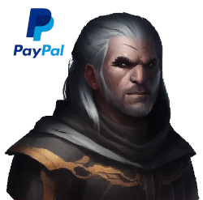

# Stable Knights (Animated) - Baseline Portraits Mod Project

Example projects which contains the mod files for the stable knights mod. Can be used as a starting point for creating your own unique species. 

This species and assets I made are far from perfect, I am sure you can do it better.

## Create your own portraits mod

At first create a new empty mod using the stellaris launcher: 

- Launch Stellaris
- Click on all installed mods on the left
- Click on "upload mod" and then "create a mod"
- Name the mod and add the tags (potraits)
- Click on "create mod"

After you created the mod copy the code from this example project into the new mod folder you created (but don't replace the descriptor.mod file). Don't replace the descriptor.mod file! You should use the one which was already created in the step before. 

If you need additional help you also find good stellaris modding tutorials on youtube. 

## Transform the generated images into game assets

At this point I assume that you already created different portraits of your species using [this](https://github.com/LeagueCode/stellaris-portraits-generation) repository and [stable diffusion web ui](https://github.com/AUTOMATIC1111/stable-diffusion-webui).

In this mod I use the standard humanoid meshes and animations of the [Humanoid_02 species](https://stellaris.paradoxwikis.com/Species#/media/File:Humanoid_02.png).
If you want to customize this you can create your own meshes and animations or pick some from the existing ones you find in the "\gfx\models\portraits" path. 
You can also find additional information for custome animations in the **[wiki](https://stellaris.paradoxwikis.com/Portrait_modding)**. 

If you want to keep the effort to a minimum you can just overwrite the faces of the exiting .dds files (for instance ["gfx/models/portraits/stable_knight/male/male_knight_01.dds"](gfx/models/portraits/stable_knight/male/male_knight_01.dds)). 
To modify the .dds file you can use gimp with the th .dds plugin to open and edit the files.
Get the image generated by stable-diffusion and crop the head. 
Add an alpha channel to the image and remove the background using the magic wand. 
Afterward you can use the edge smoothing or (gaussian) blur to further adjsut the result.

In addition you can crop the left over clothes of the generated image and replace one of the clothes .dds files with the ones you generated. 
Note that you might need to reshape the portraits and clothes to fit. 

Repeat this step to create more variants or clothers for your species. 

## Use the game assets in your mod

If you created your own .dds replace the existing .dds file with the ones you created before.
If you just edited the exisitng ones you can see the assets already in the game if you start it. 

You should rename the files and folders in your project so the names fit to the species you created. 
I recommend using visual studio code with the CWTools - Paradox Language Services for the project.
There are also several additional you can adjust in the project. For instance you can choose different outfits for different jobs like ruler, general or scientist (see ["gfx/portraits/asset_selectors/knight_asset_clothes.txt"](gfx/portraits/asset_selectors/knight_asset_clothes.txt)).
Or you can select a greeting for your species (see ["gfx/portraits/portraits/knight_portraits.txt"](gfx/portraits/portraits/knight_portraits.txt)): you can listen to samples in the [wiki](https://stellaris.paradoxwikis.com/Species).

Finally the localosation file needs to be adjustet to your new species. You can find the one for the english language here: ["localisation/english/knight_l_english.yml"](localisation/english/knight_l_english.yml). If you want to create a localisation for other languages you need to add the files in the according paths. 

Now your mod should be god to go and ready to be uploaded. 
You find the option in the "All installed mod" tab in the stellaris launcher. 

## Troubleshooting

If you want to test your mod from the workshop make sure that the local mod is not in your local mod store anymore. 
Otherwise you can not activate the workshop version [(ts shown as activated but its acutally not)](https://www.reddit.com/r/StellarisMods/comments/ey5qgo/my_mod_breaks_whenever_it_is_uploaded_to_the/). 

## Support 
If you like the mod and/or guide feel free to toss a coin to your witcher:
 
